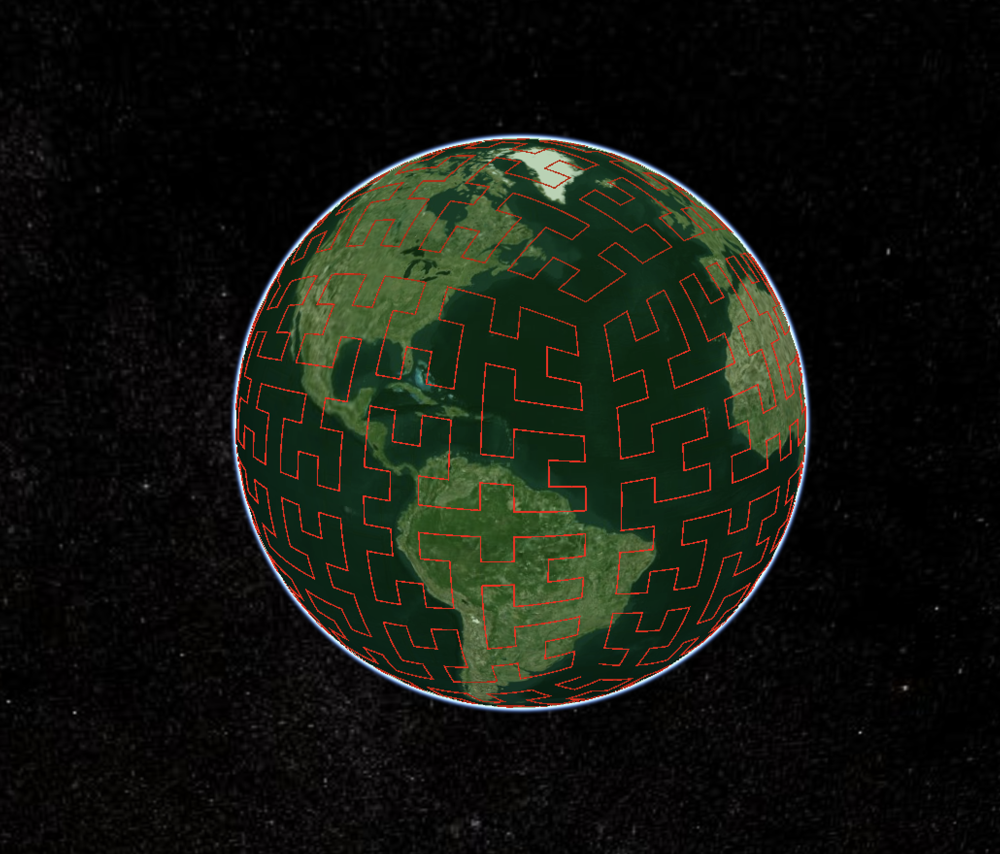
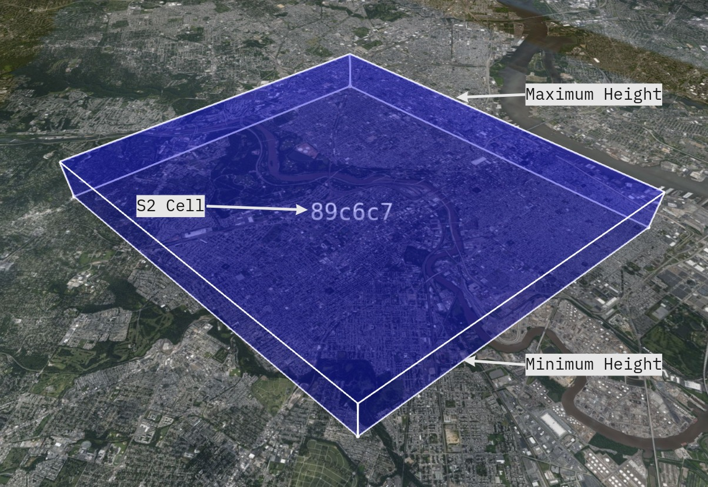
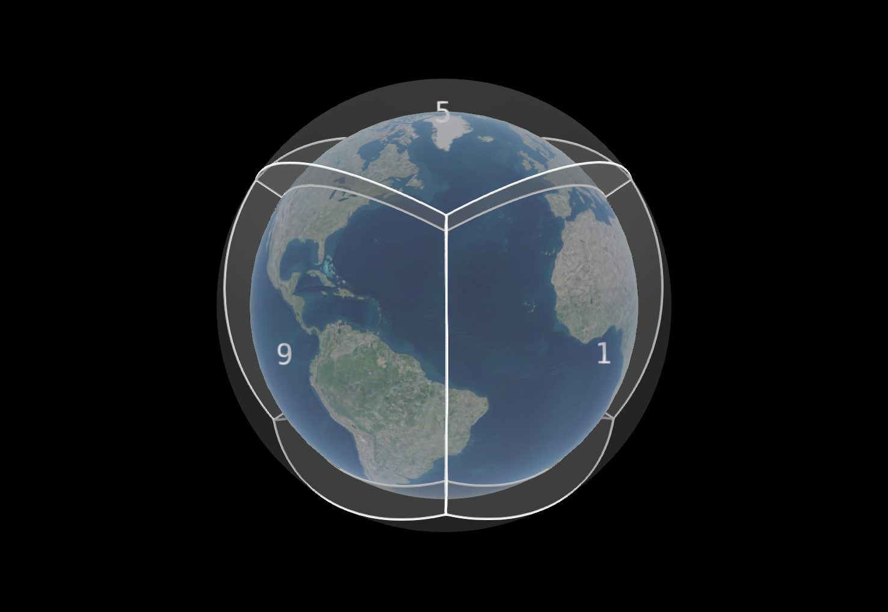

# 3DTILES_bounding_volume_S2

<!-- omit in toc -->
## Contributors

- Sam Suhag, Cesium
- Sean Lilley, Cesium
- Peter Gagliardi, Cesium

<!-- omit in toc -->
## Status

Draft

<!-- omit in toc -->
## Dependencies

Written against 3D Tiles 1.0.

<!-- omit in toc -->
## Optional vs. Required

This extension is required, meaning it must be placed in both the `extensionsUsed` and `extensionsRequired` lists in the tileset JSON.

<!-- omit in toc -->
## Contents

- [3DTILES_bounding_volume_S2](#3dtiles_bounding_volume_s2)
  - [Overview](#overview)
  - [Coordinate System](#coordinate-system)
  - [Bounding Volume](#bounding-volume)
    - [Cell Token](#cell-token)
    - [Bounding Heights](#bounding-heights)
  - [Subdivision](#subdivision)
  - [Property Reference](#property-reference)
  - [Schema Changes](#schema-changes)

## Overview

[S2](http://s2geometry.io/) is a spherical geometry library that maps the 6 faces of a unit cube onto the unit sphere. Typically, traditional GIS libraries use planar projections to map data between a 2D plane and a 3D ellipsoid (representing the Earth). Since a sphere is a closer approximation of the shape of the ellipsoid, S2 makes it possible to represent the globe with no seams or singularities, with low distortion everywhere on Earth.

|Level 0|Level 1|
|:-:|:-:|
|  S2 cell (`"1"`) on the Earth cube|  Children of S2 cell (`"1"`) on the Earth cube |
|   S2 cell (`"1"`) on the WGS84 ellipsoid|  Children of S2 cell (`"1"`) on the WGS84 ellipsoid|

In S2, each face of the unit cube can be subdivided into 30 levels using a quadtree structure, in which each "cell" or tile on the grid subdivides into 4 equal cells or tiles at the subsequent level. This extension to 3D Tiles enables using these cells as the basis for bounding volumes for tiles.

| S2 Curve on Earth cube |  S2 Curve on WGS84 ellipsoid |
|:-:|:-:|
|   |   |

The S2 library uses a modified Hilbert curve to provide a one dimensional ordering of cells on the S2 Earth cube. This provides each cell, from level 1 to level 30, with a unique 64-bit identifier. Therefore, we can uniquely identify millimeter scale areas on Earth with their S2 cell IDs.

## Coordinate System

The S2 library does not mandate the usage of geocentric or geodetic coordinates. This extension uses WGS84 geodetic coordinates for mapping the points between the Earth and the S2 sphere.

## Bounding Volume

This extension enables using S2 cells and a set of bounding heights to describe a bounding volume in 3D Tiles. The `token` represents an S2 cell. The cell describes 4 vertices on the surface of the WGS84 ellipsoid for the area, and the `minimumHeight` and `maximumHeight` describe the vertical limits with respect to the WGS84 ellipsoid.



<center>S2 cell (<tt>"89c6c7"</tt>) covering the Philadelphia Center City area, with minimum height set to <tt>0</tt> m and maximum height set to <tt>1000</tt> m.</center>

### Cell Token

This extension uses tokens, or hexadecimal string representations of S2 cell identifier for two reasons:
 1. Precision: Using a token will require a client to convert it to the correct data type: `uint64`
 2. Conciseness: Tokens provide a more concise representation of identifiers

More details on computing an `S2CellToken` can be found in the [S2 reference implementation](https://github.com/google/s2-geometry-library-java/blob/c28f287b996c0cedc5516a0426fbd49f6c9611ec/src/com/google/common/geometry/S2CellId.java#L468).

### Bounding Heights

The S2 cell itself is used to specify an area on the surface of the ellipsoid. To create a bounding volume, the `minimumHeight` and `maximumHeight` properties must be specified. These heights must be specified in meters above the WGS84 ellipsoid.

## Subdivision

The S2 library defines a [cell hierarchy](http://s2geometry.io/devguide/s2cell_hierarchy), that follows uniform subdivision using a quadtree structure, where each cell subdivides into 4 smaller cells that combine to occupy the same area as the parent.

When used with `3DTILES_implicit_tiling`, a `QUADTREE` subdivision scheme will follow the rules for subdivision as defined by S2. When an `OCTREE` subdivision scheme is used, the split in the vertical dimension occurs at the midpoint of the `minimumHeight` and `maximumHeight` of the parent tile. The `availability` bitstreams are ordered by the Morton index of the tile, as specified by `3DTILES_implicit_tiling`, not by the Hilbert index used by S2. Additionally, the `maximumLevel` property cannot be greater than `30 - {Level of root S2CellId}` because S2 cell hierarchy only extends to level 30.

| Cell  | Quadtree Subdivision | Octree Subdivision |
|---|---|---|
|   |   |   |

The following example illustrates usage of `3DTILES_bounding_volume_S2` with `3DTILES_implicit_tiling`:

```json
{
  "asset": {
    "version": "1.0"
  },
  "geometricError": 10000,
  "extensionsUsed": [
    "3DTILES_implicit_tiling",
    "3DTILES_bounding_volume_S2"
  ],
  "extensionsRequired": [
    "3DTILES_implicit_tiling",
    "3DTILES_bounding_volume_S2"
  ],
  "root": {
    "boundingVolume": {
      "extensions": {
        "3DTILES_bounding_volume_S2": {
          "token": "04",
          "minimumHeight": 0,
          "maximumHeight": 500000
        }
      }
    },
    "refine": "REPLACE",
    "geometricError": 5000,
    "content": {
      "uri": "content/{level}/{x}/{y}.glb"
    },
    "extensions": {
      "3DTILES_implicit_tiling": {
        "subdivisionScheme": "QUADTREE",
        "subtreeLevels": 4,
        "maximumLevel": 7,
        "subtrees": {
          "uri": "subtrees/{level}/{x}/{y}.subtree"
        }
      }
    }
  }
}
```

The following example usage of `3DTILES_bounding_volume_S2` to represent all 6 faces of S2, to represent a tileset with global coverage:



```json
{
  "asset": {
    "version": "1.0"
  },
  "geometricError": 10000,
  "extensionsUsed": [
    "3DTILES_implicit_tiling",
    "3DTILES_bounding_volume_S2"
  ],
  "extensionsRequired": [
    "3DTILES_implicit_tiling",
    "3DTILES_bounding_volume_S2"
  ],
  "root": {
    "boundingVolume": {
      "region": [
        -3.141592653589793,
        -1.5707963267948966,
        3.141592653589793,
        1.5707963267948966,
        0,
        250000
      ]
    },
    "refine": "REPLACE",
    "geometricError": 10000,
    "children": [
      {
        "boundingVolume": {
          "extensions": {
            "3DTILES_bounding_volume_S2": {
              "token": "1",
              "minimumHeight": 0,
              "maximumHeight": 1000000
            }
          }
        },
        "refine": "REPLACE",
        "geometricError": 5000,
      },
      {
        "boundingVolume": {
          "extensions": {
            "3DTILES_bounding_volume_S2": {
              "token": "3",
              "minimumHeight": 0,
              "maximumHeight": 1000000
            }
          }
        },
        "refine": "REPLACE",
        "geometricError": 5000,
      },
      {
        "boundingVolume": {
          "extensions": {
            "3DTILES_bounding_volume_S2": {
              "token": "5",
              "minimumHeight": 0,
              "maximumHeight": 1000000
            }
          }
        },
        "refine": "REPLACE",
        "geometricError": 5000,
      },
      {
        "boundingVolume": {
          "extensions": {
            "3DTILES_bounding_volume_S2": {
              "token": "7",
              "minimumHeight": 0,
              "maximumHeight": 1000000
            }
          }
        },
        "refine": "REPLACE",
        "geometricError": 5000,
      },
      {
        "boundingVolume": {
          "extensions": {
            "3DTILES_bounding_volume_S2": {
              "token": "9",
              "minimumHeight": 0,
              "maximumHeight": 1000000
            }
          }
        },
        "refine": "REPLACE",
        "geometricError": 5000,
      },
      {
        "boundingVolume": {
          "extensions": {
            "3DTILES_bounding_volume_S2": {
              "token": "b",
              "minimumHeight": 0,
              "maximumHeight": 1000000
            }
          }
        },
        "refine": "REPLACE",
        "geometricError": 5000,
      }
    ]
  }
}
```

## Property Reference

**`3DTILES_bounding_volume_S2 extension` Properties**

|   |Type|Description|Required|
|---|---|---|---|
|**token**|`string`|A hexadecimal representation of the S2 cell identifier. Tokens must be lower-case (except X), must not contain whitespace and must have trailing zeros stripped.| &#10003; Yes|
|**minimumHeight**|`number`|The minimum height of the tile, specified in meters above (or below) the WGS84 ellipsoid.| &#10003; Yes|
|**maximumHeight**|`number`|The maximum height of the tile, specified in meters above (or below) the WGS84 ellipsoid.| &#10003; Yes|
|**extensions**|`object`|Dictionary object with extension-specific objects.| No|
|**extras**|`any`|Application-specific data.| No|

Additional properties are not allowed.

<!-- omit in toc -->
#### token ✅

A hexadecimal representation of the S2CellId. The 0 S2CellId must be represented as 'X'. Tokens must be lower-case (except X), must not contain whitespace and must have trailing zeros stripped.

* **Type**: `string`
* **Required**:  &#10003; Yes

<!-- omit in toc -->
#### minimumHeight ✅

The minimum height of the tile, specified in meters above (or below) the WGS84 ellipsoid.

* **Type**: `number`
* **Required**:  &#10003; Yes

<!-- omit in toc -->
#### maximumHeight ✅

The maximum height of the tile, specified in meters above (or below) the WGS84 ellipsoid.

* **Type**: `number`
* **Required**:  &#10003; Yes

<!-- omit in toc -->
#### extensions

Dictionary object with extension-specific objects.

* **Type**: `object`
* **Required**: No

<!-- omit in toc -->
#### extras

Application-specific data.

* **Type**: `any`
* **Required**: No


## Schema Changes

The changes to the schema are documented in the [extension schema](schema/boundingVolume.3DTILES_bounding_volume_S2.schema.json).
