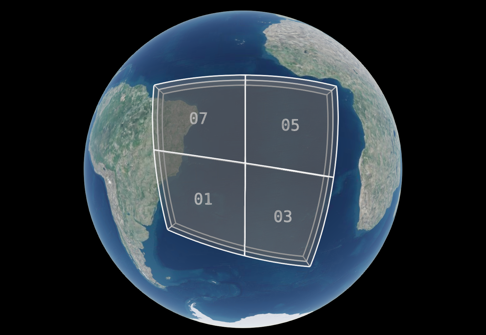
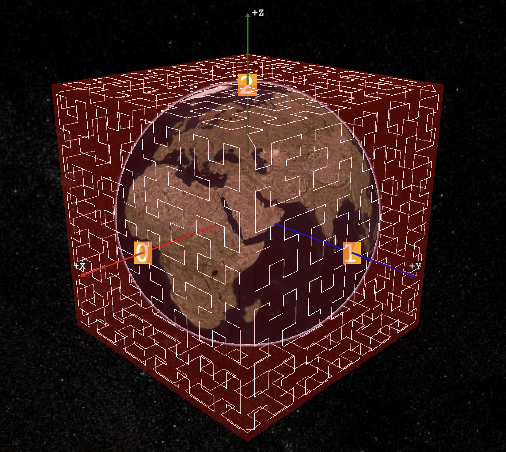

# 3DTILES_bounding_volume_S2

## Contributors

- Sam Suhag, Cesium
- Sean Lilley, Cesium
- Peter Gagliardi, Cesium

## Dependencies

Written against 3D Tiles 1.0.

## Optional vs. Required

This extension is required, meaning it must be placed in both the `extensionsUsed` and `extensionsRequired` lists in the tileset JSON.

## Contents

- [3DTILES_bounding_volume_S2](#3dtiles_bounding_volume_s2)
  - [Contributors](#contributors)
  - [Dependencies](#dependencies)
  - [Optional vs. Required](#optional-vs-required)
  - [Contents](#contents)
  - [Overview](#overview)
  - [Coordinate System](#coordinate-system)
  - [Cell Token](#cell-token)
  - [Heights](#heights)
  - [Subdivision](#subdivision)
  - [Schema Changes](#schema-changes)

## Overview

[S2](http://s2geometry.io/) is a spherical geometry library that maps the 6 faces of a unit cube onto the unit sphere. Typically, traditional GIS libraries use planar projections to map data between a 2D plane and a 3D ellipsoid (representing the Earth). Since a sphere is a closer approximation of the shape of the ellipsoid, S2 makes it possible to represent the globe with no seams or singularities, with low distortion everywhere on Earth.

In S2, each face of the unit cube can be subdivided into 30 levels using a quadtree structure, in which each "cell" or tile on the grid subdivides into 4 equal cells or tiles at the subsequent level. This extension to 3D Tiles enables using these cells as the basis for bounding volumes for tiles.

| S2 Curve on Cube Face  |  S2 Curve on WGS84 Ellipsoid |
|---|---|
|   |   |

## Coordinate System

The S2 library does not mandate the usage of geocentric or geodetic coordinates. This extension uses WGS84 geodetic coordinates for mapping the points between the Earth and the S2 sphere.

## Cell Token

This extension uses tokens, or hexadecimal string representations of `S2CellId` for two reasons:
 1. Precision: Using a token will require a client to convert it to the correct data type: `uint64`
 2. Conciseness: Tokens provide a more concise representation of `S2CellId`s

More details on computing an `S2CellToken` can be found in the [S2 reference implementation](https://github.com/google/s2-geometry-library-java/blob/c28f287b996c0cedc5516a0426fbd49f6c9611ec/src/com/google/common/geometry/S2CellId.java#L468).

## Heights

The S2 cell itself is used to specify an area on the surface of the ellipsoid. To create a bounding volume, the `minimumHeight` and `maximumHeight` properties must be specified. These heights must be specified in meters above the WGS84 ellipsoid.

## Subdivision

The S2 library defines a [cell hierarchy](http://s2geometry.io/devguide/s2cell_hierarchy), that follows uniform subdivision using a quadtree structure, where each cell subdivides into 4 smaller cells that combine to occupy the same area as the parent.

When used with `3DTILES_implicit_tiling`, a `QUADTREE` subdivision scheme will follow the rules for subdivision as defined by S2. When an `OCTREE` subdivision scheme is used, the split in the vertical dimension occurs at the midpoint of the `minimumHeight` and `maximumHeight` of the parent tile. The `availability` bitstreams are ordered by the Morton index of the tile, as specified by `3DTILES_implicit_tiling`, not by the Hilbert index used by S2. Additionally, the `maximumLevel` property cannot be greater than `30 - {Level of root S2CellId}` because S2 cell hierarchy only extends to level 30.

| Cell  | Quadtree Subdivision | Octree Subdivision |
|---|---|---|
|   |   |   |

The following example illustrates usage of `3DTILES_bounding_volume_S2` with `3DTILES_implicit_tiling`:

```json
{
  "asset": {
    "version": "1.0"
  },
  "geometricError": 10000,
  "extensionsUsed": [
    "3DTILES_implicit_tiling",
    "3DTILES_bounding_volume_S2"
  ],
  "extensionsRequired": [
    "3DTILES_implicit_tiling",
    "3DTILES_bounding_volume_S2"
  ],
  "root": {
    "boundingVolume": {
      "extensions": {
        "3DTILES_bounding_volume_S2": {
          "token": "2ef59",
          "minimumHeight": 0,
          "maximumHeight": 25000
        }
      }
    },
    "refine": "REPLACE",
    "geometricError": 5000,
    "content": {
      "uri": "content/{level}/{x}/{y}.glb"
    },
    "extensions": {
      "3DTILES_implicit_tiling": {
        "subdivisionScheme": "QUADTREE",
        "subtreeLevels": 4,
        "maximumLevel": 7,
        "subtrees": {
          "uri": "subtrees/{level}/{x}/{y}.subtree"
        }
      }
    }
  }
}
```

The following example usage of `3DTILES_bounding_volume_S2` to represent all 6 faces of S2, to represent a tileset with global coverage:



```json
{
  "asset": {
    "version": "1.0"
  },
  "geometricError": 10000,
  "extensionsUsed": [
    "3DTILES_implicit_tiling",
    "3DTILES_bounding_volume_S2"
  ],
  "extensionsRequired": [
    "3DTILES_implicit_tiling",
    "3DTILES_bounding_volume_S2"
  ],
  "root": {
    "boundingVolume": {
      "region": [
        -3.141592653589793,
        -1.5707963267948966,
        3.141592653589793,
        1.5707963267948966,
        0,
        250000
      ]
    },
    "refine": "REPLACE",
    "geometricError": 10000,
    "children": [
      {
        "boundingVolume": {
          "extensions": {
            "3DTILES_bounding_volume_S2": {
              "token": "1",
              "minimumHeight": 0,
              "maximumHeight": 25000
            }
          }
        },
        "refine": "REPLACE",
        "geometricError": 5000,
      },
      {
        "boundingVolume": {
          "extensions": {
            "3DTILES_bounding_volume_S2": {
              "token": "3",
              "minimumHeight": 0,
              "maximumHeight": 25000
            }
          }
        },
        "refine": "REPLACE",
        "geometricError": 5000,
      },
      {
        "boundingVolume": {
          "extensions": {
            "3DTILES_bounding_volume_S2": {
              "token": "5",
              "minimumHeight": 0,
              "maximumHeight": 25000
            }
          }
        },
        "refine": "REPLACE",
        "geometricError": 5000,
      },
      {
        "boundingVolume": {
          "extensions": {
            "3DTILES_bounding_volume_S2": {
              "token": "7",
              "minimumHeight": 0,
              "maximumHeight": 25000
            }
          }
        },
        "refine": "REPLACE",
        "geometricError": 5000,
      },
      {
        "boundingVolume": {
          "extensions": {
            "3DTILES_bounding_volume_S2": {
              "token": "9",
              "minimumHeight": 0,
              "maximumHeight": 25000
            }
          }
        },
        "refine": "REPLACE",
        "geometricError": 5000,
      },
      {
        "boundingVolume": {
          "extensions": {
            "3DTILES_bounding_volume_S2": {
              "token": "b",
              "minimumHeight": 0,
              "maximumHeight": 25000
            }
          }
        },
        "refine": "REPLACE",
        "geometricError": 5000,
      }
    ]
  }
}
```


## Schema Changes

The changes to the schema are documented in the [extension schema](schema/boundingVolume.3DTILES_bounding_volume_S2.schema.json).