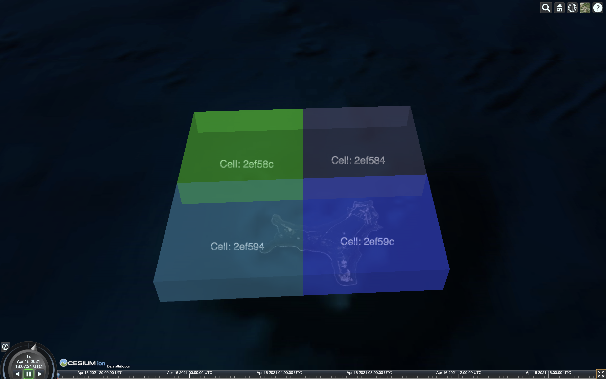

# 3DTILES_bounding_volume_S2

## Contributors

## Status

Draft

## Dependencies

Written against 3D Tiles 1.0. It may be used in conjunction with [`3DTILES_implicit_tiling`](https://github.com/CesiumGS/3d-tiles/tree/3d-tiles-next/extensions/3DTILES_implicit_tiling/0.0.0).

## Overview

[S2](http://s2geometry.io/) is a spherical geometry library that represents all data on a 3D sphere, unlike traditional libraries that use 2D planar projections. This makes it possible to represent the globe with no seams or singularities, with low distortion everywhere on Earth. The S2 library involves projecting the 6 faces of a cube on a unit sphere, creating 6 root "cells" that subdivide evenly into 4 tiles, into a quadtree structure.

This extension to 3D Tiles enables using S2 cells as a `boundingVolume`, and uses `3DTILES_implict_tiling` to enforce subdivision.

| S2 Curve on Cube Face  |  S2 Curve on WGS84 Ellipsoid |
|---|---|
|   |   |

## Coordinate System

The S2 library does not mandate the usage of geocentric or geodetic coordinates, however, for this extension, we use WGS84 geodetic coordinates for mapping the points between the Earth and the S2 sphere.

## Cell Token

Cells in S2 are repesented using 64-bit `S2CellId`s. To ensure these numbers are not interpreted as 32-bit integers, in this extension, they are required to be encoded in their hexadecimal string representation, the `S2CellToken`. More details on computing an `S2CellToken` can be found in the [S2 reference implementation](https://github.com/google/s2-geometry-library-java/blob/c28f287b996c0cedc5516a0426fbd49f6c9611ec/src/com/google/common/geometry/S2CellId.java#L468).

## Heights

The S2 cell itself is used to specify an area on the surface of the ellipsoid. To create a bounding volume, the `minumumHeight` and `maximumHeight` properties must be specified. These heights must be specified in meters above the WGS84 ellipsoid.

| Parent Cell  |  Children Cells |
|---|---|
|   |   |

## Subdivision

 The S2Geometry library uses the Hilbert surface filling curve to map a 2D array into a 1D array. The curve increases in granularity with each successive level of detail. Each tile subdivides into a 4 smaller tiles. When the `quadtree` tiling scheme is used, the bounding volume subdivides into these 4 tiles retaining the same bounding heights. When the `octree` tiling scheme is used, the bounding volume of the tile subdivides into these 4 tiles, with an additional split at the midpoint of the bounding heights, yielding 8 children tiles.

## Schema Changes

The changes to the schema can documented in [extension.schema.json](schema/extension.schema.json).