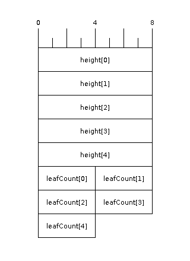
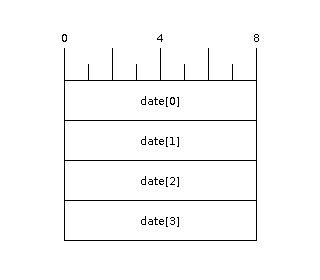
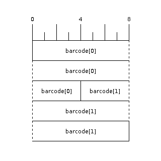
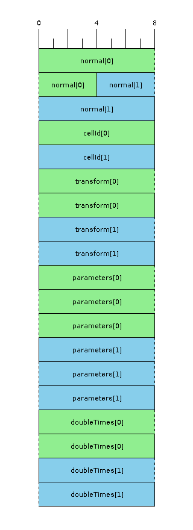
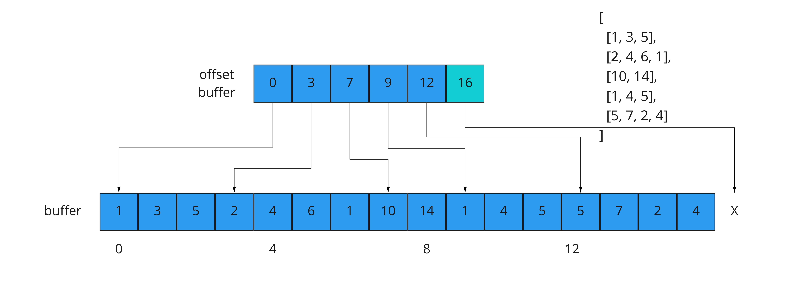
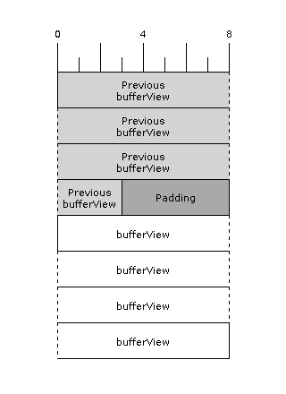
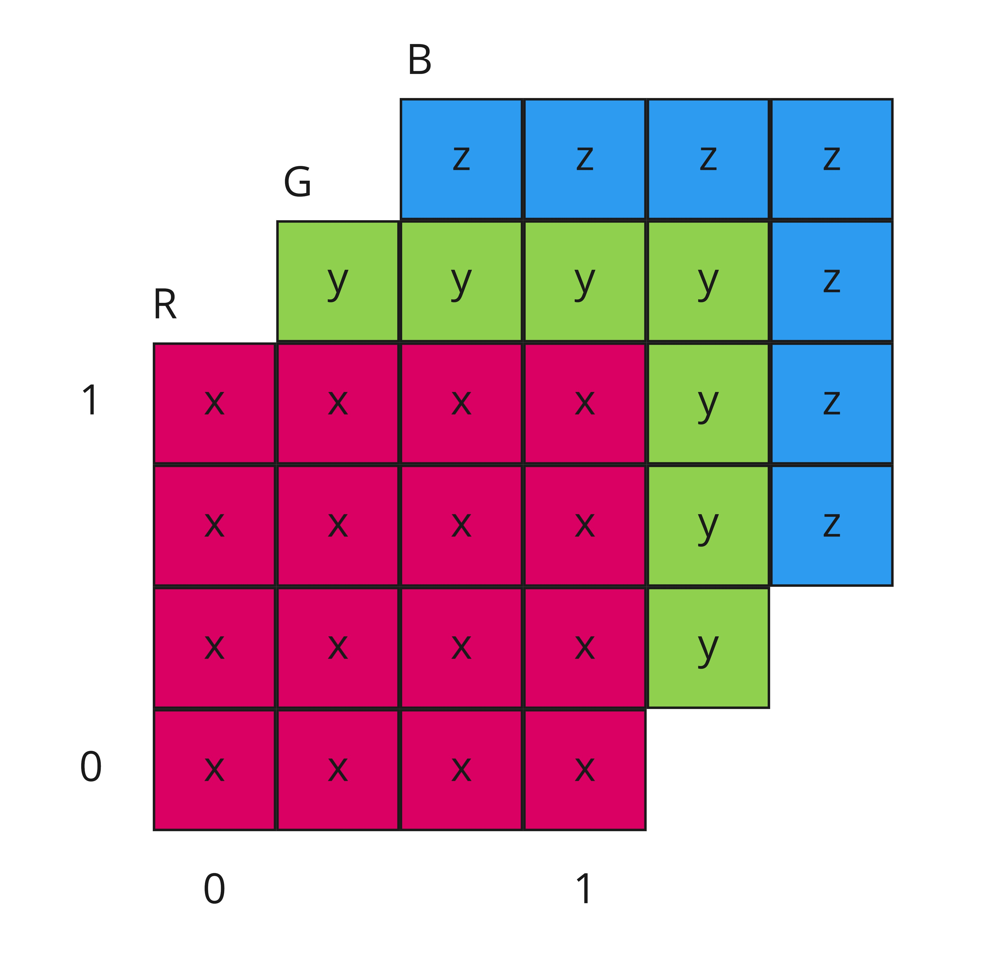

<!-- omit in toc -->
# Cesium 3D Metadata Specification

**Version 0.0.0** November 6, 2020

<!-- omit in toc -->
## Contributors

* Peter Gagliardi, Cesium
* Sean Lilley, Cesium
* Sam Suhag, Cesium
* Bao Tran, Cesium
* Samuel Vargas, Cesium
* Patrick Cozzi, Cesium

<!-- omit in toc -->
## Status

Draft

<!-- omit in toc -->
## Table of Contents

- [Introduction](#introduction)
  - [Metadata at Many Granularities](#metadata-at-many-granularities)
- [Overview](#overview)
- [Concepts](#concepts)
  - [Data Types](#data-types)
  - [Classes and Properties](#classes-and-properties)
  - [Instances](#instances)
    - [Instance Tables](#instance-tables)
    - [JSON Encoding](#json-encoding)
    - [Binary Encoding](#binary-encoding)
    - [Metadata Texture Encoding](#metadata-texture-encoding)
    - [Comparison of Encodings](#comparison-of-encodings)
  - [Separate Class Definition from Instantiation](#separate-class-definition-from-instantiation)
- [Class Definitions](#class-definitions)
  - [Basic Types](#basic-types)
  - [Normalized Properties](#normalized-properties)
  - [Arrays](#arrays)
  - [Optional and Default Properties](#optional-and-default-properties)
- [Storage Encodings](#storage-encodings)
  - [JSON Encoding](#json-encoding-1)
    - [Basic Types](#basic-types-1)
    - [Bit Depth of Numeric Types](#bit-depth-of-numeric-types)
    - [Array Types](#array-types)
    - [Fixed-length Strings and Blobs](#fixed-length-strings-and-blobs)
    - [Optional and Default Values](#optional-and-default-values)
    - [Single Instance Shorthand](#single-instance-shorthand)
  - [Binary Encoding](#binary-encoding-1)
    - [Numeric Types](#numeric-types)
    - [Strings and Blobs](#strings-and-blobs)
    - [Fixed-length Strings and Blobs](#fixed-length-strings-and-blobs-1)
    - [Fixed-size Arrays](#fixed-size-arrays)
    - [Variable-size Arrays](#variable-size-arrays)
    - [Boolean Data](#boolean-data)
    - [Binary Alignment Rules](#binary-alignment-rules)
  - [Metadata Texture Encoding](#metadata-texture-encoding-1)
    - [Numeric Textures](#numeric-textures)
    - [Array Textures](#array-textures)
    - [Implementation Notes](#implementation-notes)
- [Glossary](#glossary)

## Introduction

OUTLINE:
- key benefits:
  - standardized semantics makes it easier to implement UIs
  - runtime efficiency for large datasets 
  - texel metadata is even more fine-grained than per-vertex or per-triangle

### Metadata at Many Granularities

_This section is non-normative._

In the 3D Tiles ecosystem, metadata is useful at several different granularities.

Consider a Cesium 3D Tileset of a city. It is useful to annotate the data with metadata that can be displayed in a UI or used for computations at runtime.

At the coarsest granularity, metadata can be assigned to a tileset. This may include information such as:

* The author(s) that produced the tileset
* The year the tileset was produced
* A paragraph describing what the tileset represents

DIAGRAM: Adding metadata to a tileset

This metadata could be used to give a preview of the tileset before rendering it. For example, an application may have a UI for selecting a tileset. The metadata could be shown in a preview window to help the user find the desired data.

DIAGRAM: UI for selecting tilesets

Going deeper, metadata can be stored for each tile. Examples include:

* The total number of buildings in each tile
* The height of the tallest building within a tile

DIAGRAM: Adding metadata to each tile

Storing this information per-tile could be used for avoiding calculations at runtime. For example, computing the total number of buildings in the city becomes a simple lookup of metadata from the root tile.

DIAGRAM: compute the # of buildings in a city

Next, zoom in on the 3D model of a single tile. For example, a model of a city might be a triangle mesh of buildings, trees and cars.

* Each primitive can be labeled as a building, tree, or car.
* The vertices of a tree can be further classified as the trunk of the tree or the leaves.
* Each building may have a height and total floor area

DIAGRAM: Metadata scoped to features

At runtime, a user could click a specific building. The application could then display relevant metadata in the UI.

DIAGRAM: Metadata 

Finally, zoom in even further at the wall of a building. Suppose the building is modeled as a simple box with a texture. Metadata can be stored at each texel, such as:

* The material of that part of the wall such as concrete, glass or steel.
* whether the wall is in good condition or damaged at that point.
* Surface temperature of the wall at that point

DIAGRAM: metadata textures

This metadata can be used by the rendering engine for fine-tuned styling. It could also be used in a UI so when a user clicks a point, metadata about that point could be displayed on the screen.

3D Tiles Metadata is designed to support these various levels of granularity

## Overview

This specification provides a standard format for adding metadata to Cesium 3D Tiles as well as glTF models. It provides a method for defining metadata, as well as methods for storing this metadata in JSON, binary, or texture encodings. This metadata format is shared by several Cesium specifications. This avoids repetition and enforces a consistent data layout. Specifications that reference this document must include at least one metadata encoding as described in this document, and must make clear which encodings are supported.

```
features = geometry + metadata
```

Using terminology from the geospatial industry, **features** are geometric entities in 3D space (**geometry**) and may have application specific properties associated with them (**metadata**). These properties may span a myriad of domains, such as the heights of buildings in a city, the names of different structures in a CAD model, the classification of different points in a point cloud, or the age of different trees in a forest of instanced tree models.

This specification adds a mechanism for storing metadata in existing 3D model formats such as Khronos Group's glTF or Cesium's 3D Tiles. Metadata can be applied at various granularities: per-vertex, per-texel, as well as larger structures from meshes to tilesets. This metadata can be used for analytics purposes, as well as styling in a 3D renderer.

Guiding principles include:

- Design a data format that allows for runtime efficiency, even for large datasets.
- Keep class definitions separate from instantiation. This allows for greater flexibility of data formats, and allows for reuse of metadata definitions.s

For a complete list of vocabulary used, see the [Glossary](#glossary)

## Concepts

### Data Types

**Primitive types** are data types that cannot be divided further. These include:

* Boolean values (`BOOLEAN`)
* Signed integers (`INT8`, `INT16`, `INT32`, `INT64`)
* Unsigned integers (`INT8`, `INT16`, `INT32`, `INT64`)
* Floating point numbers (`FLOAT16`, `FLOAT32`, `FLOAT64`)
* Strings (`STRING`)

Even though a string is a sequence of characters, it is considered to be a single indivisible value when storing metadata.

**Array types** (`ARRAY`) are sequences of a single primitive type. The values are stored contiguously. Arrays can be fixed length or variable length.

DIAGRAM: array types

### Classes and Properties

A **property** is the basic unit for defining metadata. A property consists of an identifier and a data type. Properties may also have a human-readable name and description.

A **class** is a collection of related properties. A class may also have a human-readable name and description. The identifiers for properties must be unique within a class.

DIAGRAM: example classes

```json
{
  "classes": {
    "building": {
      "name": "Building",
      "description": "Buildings in the town",
      "properties": {
        "height": {
          "name": "Building Height",
          "description": "Height of the building in meters",
          "type": "FLOAT32"
        },
        "windows": {
          "name": "Number of Windows",
          "description": "How many windows this building has",
          "type": "UINT16"
        }
      }
    },
    "tree": {
      "name": "Tree",
      "description": "Trees in the town",
      "properties": {
        "height": {
          "name": "Height",
          "description": "Height of the tree in meters",
          "type": "FLOAT32",
        },
        "age": {
          "name": "Age",
          "description": "Age of the tree in years",
          "type": "UINT8"
        },
        "leafColor": {
          "name": "Leaf Color",
          "description": "The color of the tree's leaves.",
          "type": "STRING",
          "optional": true,
          "default": "green"
        }
      }
    }
  }
}
```

Above, we define a `building` class to describe the street address and height of various buildings in a 3D scene. Likewise, the `tree` class describes trees that have a height, age, and leaf color.

### Instances

A class definition is abstract, and only describes what metadata exists. Meanwhile, an **instance** is a concrete representation of the metadata for a single entity. Instance is a general concept; the concept of "feature" mentioned in the introduction is one example of an instance.

Instances are stored in two formats: a columnar format (**instance tables**) and a texture-based format (**metadata textures**). Instance tables are for general purpose metadata storage. Metadata textures are for storing fine-grained data in image textures.

DIAGRAM: Instance table and metadata texture

Whether an instance table or a metadata texture, the structure of the data must match one-to-one with a class definition.

data must match one-to-one with a class definition. For example, in the previous section, the `building` class defined two properties, `address` and `height`. A corresponding instance table must include data for both `address` and `height`. The instance table may not have any extraneous properties. If more are desired, they can be defined in separate instance tables.

Below is an example of a well-formed instance table representing a class.

```json
{
  "classes": {
    "building": {
      "name": "Building",
      "properties": {
        "address": {
          "name": "Street Address",
          "type": "STRING"
        },
        "height": {
          "name": "Building Height",
          "description": "Height of the building in meters",
          "type": "FLOAT32"
        }
      }
    },
  },
  "instanceTables": {
    "buildingTable": {
      "class": "building",
      "count": 2,
      "properties": {
        "address": {
          "values": ["123 Somewhere St.", "456 Elsewhere St."]
        },
        "height": {
          "values": [13.0, 20.0]
        }
      }
    }
  }
}
```

#### Instance Tables

An instance table is a mapping of **instance IDs** to metadata values which are stored in parallel arrays called **property arrays**. Instance IDs are simply integer indices into these arrays. The `i-th` value of every property array in an instance table together makes up the metadata for the `i-th` instance. 

The instance table has two possible representations: JSON and binary. The following sections compare the two encodings.

#### JSON Encoding

JSON Encoding is designed for readability and convenience for small datasets. Data values are directly encoded in JSON wherever possible.

The following table shows a possible JSON encoding for the `building` class
defined above.

```json
{
  "instanceTables": {
    "buildingTable": {
      "class": "building",
      "count": 2,
      "properties": {
        "address": {
          "values": ["123 Somewhere St.", "456 Elsewhere St."]
        },
        "height": {
          "values": [13.0, 20.0]
        }
      }
    }
  }
}
```

#### Binary Encoding

Binary encoding is the preferred encoding in most cases since it is designed for storage and runtime efficiency. It is designed with large datasets in mind.

Here is a small example to show how the same `building` class described above would be described with an instance table.

```json
{
  "instanceTables": {
    "buildingTable": {
      "class": "building",
      "count": 2,
      "properties": {
        "address": {
          "bufferView": 2,
          "offsetBufferViews": [3],
        },
        "height": {
          "bufferView": 4,
        }
      }
    }
  }
}
```

#### Metadata Texture Encoding

The metadata texture encoding serves a different purpose than the other encodings. Instead of associating metadata with an instance, this encoding associates metadata with each individual texel in a texture. In this situation, values are indexed by texture coordinates rather than instance ID. This allows, among other things, interpolation of metadata values (at least for numeric types).

This is useful for continuous properties such as elevation, vegetation index, vector fields, and many other properties that vary with position. It also can be used for better compression of metadata values in some cases.

```jsonc
{
  "classes": {
    "vegetation": {
      "properties": {
        "vegetationIndex": {
          "type": "UINT8",
          "normalized": true
        }
      }
    }
  },
  "metadataTextures": {
    "vegetationTexture": {
      "class": "vegetation",
      "properties": {
        "vegetationIndex": {
          "channels": "r",
          "texture": {
            "index": 0,
            "texCoord": 0
          }
        }
      }
    }
  }
}
```

The method of selecting a texture is implementation-defined. The above example is based on a glTF implementation where `index` selects a texture and `texCoord` selects the texture coordinates. Other implementations may do select a texture by other means.

#### Comparison of Encodings

There are three different encodings for representing properties: JSON, binary and texture encodings.

JSON encoding is useful for encoding data where readability matters. This works well for small amounts of data, but does not scale well to large datasets. If the metadata is expected to grow large, binary encoding would be a better choice. One situation where JSON encoding is helpful is if metadata will be edited by hand, as JSON is easier for a human to understand than editing a binary buffer.

Binary encoding is designed for storage efficiency, and is designed for use with large datasets. Data is packed in parallel arrays, one per property. This allows for storage optimizations based on data type, such as storing boolean properties as a tightly packed bit vector. This encoding is more involved than the JSON encoding, but it is much preferred in most cases where performance is an important consideration.

These first two encodings are designed for discrete properties indexed by instance ID. In contrast, metadata textures are used when instances are identified by spatial position (i.e. texture coordinates within a texture). Heightmaps and vector fields are two examples. This type of per-texel metadata has many uses, but is also somewhat limited by the image formats used to store data.

Comparison table: 

|   | JSON | Binary | Texture |
|---|------|--------|---------|
| Supports large datasets | No | Yes | Yes |
| Supports small datasets | Yes | Yes | Yes |
| Is human-readable | Yes | No | No |
| Indexed by instance IDs | Yes | Yes | No |
| Indexed by texture coordinates | No | No | Yes |
| Supports Optional Values | Yes | No | No |


### Separate Class Definition from Instantiation

This specification keeps class definition separate from instantiation. While this adds a level of indirection, there are several reasons for this separation:

* It allows the class definition to be stored separately from the data itself. This is useful when one has a dataset that has many 3D models with the same type of metadata. Then instead of re-defining the class many times, a single definition can be shared across multiple models
* It allows greater flexibility for storing properties. For example, take the `elevation` property from the example above. The natural representation is to use a metadata texture. However, if the corresponding 3D model is a high-resolution terrain mesh, storing the elevations per-vertex may be more appropriate.

## Class Definitions

### Basic Types

A class is a collection of properties. Each class requires a unique UTF-8 string as a class ID. This allows the classes to be referenced elsewhere in the JSON. Within the class, one or more properties is defined. Each property must have an ID that is unique within the class. Like the class IDs, this is a UTF-8 string. Each property has a type associated with it. Some types have extra options; the sections below discuss such cases.

Both classes and properties can be annotated with display names and descriptions, as in the following example:

```json
{
  "classes": {
    "ship": {
      "name": "Ship",
      "description": "Sailing ships seen in the ocean",
      "properties": {
        "length": {
          "name": "Length",
          "description": "Length of the ship from bow to stern in meters",
          "type": "FLOAT64"
        },
        "name": {
          "name": "Name",
          "type": "STRING"
        }
      }
    },
    "fish": {
      "name": "Fish",
      "description": "Fish found in the ocean",
      "properties": {
        "length": {
          "name": "Length",
          "description": "Length of the fish in centimeters",
          "type": "FLOAT32"
        }
      }
    }
  }
}
```

### Normalized Properties

In many applications, it is helpful to transform values to a normalized range, usually `[0, 1]` or `[-1, 1]` depending on the circumstance.

In this specification, the following normalization rules are applied when the property has `normalized` set to `true`:
* For unsigned integer types (`UINT8, UINT16, UINT32, UINT64`), the values will be rescaled to the range `[0, 1]` (inclusive).
* For signed integer types (`INT8, INT16, INT32, INT64`), values will be rescaled to the range `[-1, 1]` (inclusive).

**Implementation Note:** Depending on the implementation and the chosen integer type, there may be some loss of precision in the normalized values. For example, if the implementation uses 32-bit floating point variables to represent the normalized value, there are only 23 bits in the mantissa. In this case, if the value to normalize is 32- or 64-bit, a number of lower bits will be truncated when normalized. Therefore, it is highly recommended that implementations use the highest precision floats available for representing the result, and make this choice clear.

### Arrays

Sometimes, it is desirable for each instance to store an array of values. This can be done with the `ARRAY` type. Through the options, it is possible to define both fixed-size and variable-length arrays.

For all arrays, set `type` to `ARRAY` and `componentType` to the desired type for each component. For fixed-size arrays, also set `componentCount` to a positive integer to denote the number of components. For variable length arrays, leave `componentCount` undefined.

For vector-valued types such as a `vec3` or `mat4` in OpenGL, use a fixed-size array. For example, a `vec3` is an `ARRAY` of `FLOAT32` (or appropriate precision) with `componentCount` set to `3`. Meanwhile, a `mat4` would have a `componentCount` of 16.

```json
{
  "classes": {
    "car": {
      "name": "Car",
      "properties": {
        "forwardDirection": {
          "name": "Forward Direction Vector",
          "description": "This is equivalent to a double-precision vec3",
          "type": "ARRAY",
          "componentType": "FLOAT64",
          "componentCount": 3
        },
        "passengers": {
          "name": "Passenger Names",
          "description": "There are a variable number of passengers because componentCount is undefined.",
          "type": "ARRAY",
          "componentType": "STRING",
        },
        "modelMatrix": {
          "name": "Model Matrix",
          "description": "Example of a 4x4 matrix type",
          "type": "ARRAY",
          "componentType": "FLOAT32",
          "componentCount": 16
        }
      }
    }
  }
}
```

### Optional and Default Properties

Sometimes, it is desirable to mark cases where no data can be found. This can be accomplished by setting `optional: true` in the property definition. If a property has a default value, set `optional: true` and set a value for `default`.

Example:

```json
{
  "classes": {
    "vehicle": {
      "name": "Vehicle",
      "description": "Various vehicles on the road",
      "properties": {
        "driver": {
          "name": "Driver Name",
          "type": "STRING"
        },
        "passenger": {
          "name": "Passenger Name",
          "type": "STRING",
          "optional": true
        },
        "wheels": {
          "name": "Number of Wheels",
          "type": "UINT8",
          "optional": true,
          "default": 4
        }
      }
    }
  }
}
```

Optional properties are disallowed for the binary encoding in the interest of efficient runtime performance.

## Storage Encodings

The following sections provide a full description of each of the metadata encodings.

Each instance table must use the same encoding for all properties contained within. For example, if one property in an instance table is stored using binary encoding, then all other properties in this table must do likewise. If a mix of JSON and binary metadata is desired, this can be accomplished by using multiple instance tables.

### JSON Encoding

The JSON encoding is the simplest encoding, designed to be human-readable.

#### Basic Types

For JSON encoding, basic types include integers, floating point numbers, booleans, and strings. These are encoded in whatever JSON type is most appropriate. Numeric types are represented as `number`, booleans as `boolean`, and strings as `string`.

The following example shows a few of these cases

```json
{
  "classes": {
    "basicTypes": {
      "properties": {
        "floatProperty": {
          "type": "FLOAT64"
        },
        "integerProperty": {
          "type": "INT32"
        },
        "booleanProperty": {
          "type": "BOOLEAN"
        },
        "stringProperty": {
          "type": "STRING"
        }
      }
    }
  },
  "instanceTables": {
    "basicTypesTable": {
      "class": "basicTypes",
      "count": 3,
      "properties": {
        "floatProperty": {
          "values": [0.0, 0.5, 1.0]
        },
        "integerProperty": {
          "values": [1000, 3000, 2500]
        },
        "booleanProperty": {
          "values": [true, false, false]
        },
        "stringProperty": {
          "values": ["Apple", "Orange", "Cherry"]
        }
      }
    }
  }
}
```

#### Bit Depth of Numeric Types

For numeric types like `UINT8` or `INT32`, the size in bits is made explicit. Even though JSON encoding only has a single `number` type for all integers and floating point numbers, the application that consumes the JSON may make a distinction. For example, C and C++ have several different integer types such as `uint8_t`, `uint32_t`. The application is responsible for interpreting the metadata using the type specified in the class definition.

#### Array Types

Array types are straightforward to encode into JSON: instead of a single array of values, use an array of arrays. When the array has a fixed size (i.e. `componentCount` is defined), each of the inner arrays must have the same length. Otherwise, the arrays are assumed to be variable-length.

The following example shows the usage for both fixed and variable size arrays:

```json
{
  "classes": {
    "basicTypes": {
      "properties": {
        "fixedArrayProperty": {
          "type": "ARRAY",
          "componentType": "UINT8",
          "componentCount": 2
        },
        "variableSizeArrayProperty": {
          "type": "ARRAY",
          "componentType": "STRING",
        }
      }
    }
  },
  "instanceTables": {
    "basicTypesTable": {
      "class": "basicTypes",
      "count": 3,
      "properties": {
        "fixedArrayProperty": {
          "values": [
            [3, 45],
            [128, 110],
            [63, 4]
          ]
        },
        "variableSizeArrayProperty": {
          "values": [
            ["plaster", "wood", "brick"],
            ["steel", "glass"],
            ["concrete"]
          ]
        }
      }
    }
  }
}
```

#### Fixed-length Strings and Blobs

In some cases, strings have a known, fixed length. For example, an application may require dates to be entered in `YYYYMMDD` format, which will fit in exactly 8 bytes. For this,
the specification provides a `stringByteLength` property. In the JSON encoding, this byte length refers to the length of the string when UTF-8 encoded, regardless of how it is displayed.

```json
{
  "classes": {
    "basicTypes": {
      "properties": {
        "date": {
          "name": "Date (YYYYMMDD)",
          "type": "STRING",
          "stringByteLength": 8
        }
      }
    }
  },
  "instanceTables": {
    "basicTypesTable": {
      "class": "basicTypes",
      "count": 3,
      "properties": {
        "date": {
          "values": [
            "20201002",
            "20201103",
            "20201105"
          ]
        }
      }
    }
  }
}
```

#### Optional and Default Values

In JSON, optional values can be expressed by using `null` in place of the value. This is true for each data type except for arrays which follow slightly different rules:

* To denote a missing array, use `[]` instead of `null`.
* To denote an array with a missing value, use `null` in place of the missing data. For example, `[1, 2, null, 4]`.


```json
{
  "classes": {
    "sensor": {
      "name": "Temperature Sensor",
      "properties": {
        "currentTemperature": {
          "name": "Current temperature",
          "description": "A basic example of using `null` for unknown values",
          "type": "FLOAT32",
          "optional": true
        },
        "history": {
          "name": "Previous 5 sensor readings",
          "description": "This example demonstrates the use of `[]` for null arrays as well as how `null` can be used for individual array components.",
          "type": "ARRAY",
          "componentType": "STRING",
          "optional": true,
        },
        "condition": {
          "name": "Sensor condition",
          "description": "This example shows how to use `default` to fill in `null` elements. In this case, `null` means `Good Condition`",
          "type": "STRING",
          "optional": true,
          "default": "Good Condition"
        }
      }
    }
  },
  "instanceTables": {
    "sensorTable": {
      "class": "sensor",
      "count": 3,
      "properties": {
        "currentTemperature": {
          "values": [
            0.9,
            0.8,
            null
          ]
        },
        "history": {
          "values": [
            [0.8, 0.9, 0.9, 0.8, 0.8],
            [null, null, 0.7, 0.6, 0.7],
            []
          ]
        },
        "condition": {
          "values": [
            null,
            null,
            "Malfunctioning. Needs maintenance"
          ]
        }
      }
    }
  }
}
```

#### Single Instance Shorthand

In most situations, there are several instances of a class. Therefore, an array is a natural choice for the JSON representation. In cases where only a single instance is used, this specification allows for a simpler property dictionary.

To enable this shorthand, omit the `count` field. Then `properties` is interpreted as a dictionary of property names to single values. This is more convenient than the usual behavior where a nested object is used for each property.

Optional properties may be omitted when using the shorthand, as in the case of the `company` field in the example below.

The following example compares the two formats of JSON encoding:

```json
{
  "classes": {
    "datasetInfo": {
      "properties": {
        "date": {
          "type": "STRING",
        },
        "authors": {
          "type": "ARRAY",
          "componentType": "STRING",
        },
        "company": {
          "type": "STRING",
          "optional": true
        }
      }
    }
  },
  "instanceTables": {
    "verboseTable": {
      "name": "Verbose property example",
      "description": "This is the typical way to represent properties, as it supports any number of instances.",
      "class": "datasetInfo",
      "count": 1,
      "properties": {
        "date": {
          "values": ["2020-11-03"]
        },
        "authors": {
          "values": [
            ["Jane Doe", "John Smith"]
          ]
        },
        "company": {
          "values": [null]
        }
      } 
    },
    "shorthandTable": {
      "name": "Shorthand property example",
      "description": "This is equivalent to the table above, just more concise",
      "class": "datasetInfo",
      "properties": {
        "date": "2020-11-03",
        "authors": ["Jane Doe", "John Smith"]
      }
    }
  }
}
```

### Binary Encoding

The binary encoding represents the columns of an instance table using parallel arrays called **property arrays**. These arrays are stored as **buffer views** in a binary **buffer**. A buffer is a contiguous array of bytes, while a buffer view is a subsequence of a buffer. Both buffers and buffer views correspond directly with [glTF concepts](https://github.com/KhronosGroup/glTF/tree/master/specification/2.0#buffers-and-buffer-views).

Buffer views are referred to by an integer index. There may be additional buffer views in a binary file not used for metadata. For example, in a glTF-based implementation, there may be other buffer views for storing the geometry of a 3D model.

#### Numeric Types 

In the binary encoding, numeric types (integers and floating point numbers) are the easiest to encode. Values are packed in little-endian format into one property array `bufferView`. This `bufferView` is subject to the [binary alignment rules](#binary-alignment-rules) (namely, align to 8-byte boundaries)

Here is an example of how to define an instance table for basic integer and float properties.

```json
{
  "classes": {
    "tree": {
      "properties": {
        "height": {
          "name": "Height",
          "description": "Height of tree in meters",
          "type": "FLOAT64"
        },
        "leafCount": {
          "name": "Number of Leaves",
          "description": "Estimated number of leaves on this tree",
          "type": "UINT32"
        }
      }
    }
  },
  "instanceTables": {
    "treeTable": {
      "class": "tree",
      "count": 5,
      "properties": {
        "height": {
          "bufferView": 7,
        },
        "leafCount": {
          "bufferView": 8
        }
      }
    }
  }
}
```



_(lengths measured in bytes)_

#### Strings and Blobs

Strings and binary blobs are somewhat similar when represented in binary. They both represent a sequence of bytes treated as a single unit. However, the encoding and intent is different. Strings must be UTF-8 encoded, which means that each Unicode code point may take up 1-4 bytes. Meanwhile, binary blobs are an arbitrary sequence of bytes.

Strings and binary blobs are typically variable-length in terms of number of code points/bytes respectively. In order to store these efficiently in binary, some indirection is useful. The elements are packed tightly into a single `bufferView`. The index of this `bufferView` is referenced in the instance table's definition via the `bufferView` property.

Since the length of each element is not predictable, an **offset buffer** is used instead. If there are `N` strings/blobs in the property array, then the offset buffer has `N + 1` elements. The first `N` of these point to the start byte of each string/blob, while the last one points to the byte immediately after the last string/blob. This way, the length of the `i-th` string (0-indexed) can be determined with the formula `length = offsetBuffer[i + 1] - offsetBuffer[i]`. The offset buffer is referenced by adding the index to the `offsetBufferViews` array in the JSON. For strings and blobs, this will always be the last element of the array. More on `offsetBufferViews` can be found in the [Variable-size Arrays](#variable-size-arrays) section below.

The size of each offset can be configured with `offsetComponentType`. It defaults to `UINT32`, but it can be made as small as `UINT8` for small datasets or as large as `UINT64` for datasets with a large number of elements.

For an example, let's suppose we have weather forecast data that stores the UTF-8 strings 

```json
[
  "Rain🌧️",
  "T-storm⛈️",
  "Sunny☀️"
]
```

The following code snippet and diagram show how this would be expressed using this metadata format.

```json
{
  "classes": {
    "weather": {
      "properties": {
        "forecast": {
          "type": "STRING"
        }
      }
    }
  },
  "instanceTables":  {
    "count": 3,
    "forecast": {
      "bufferView": 5,
      "offsetBufferViews": [6]
    }
  }
}
```


#### Fixed-length Strings and Blobs

For fixed-length strings and blobs, we can avoid the overhead of the offset buffer by specifying a constant length in bytes. Then the `bufferView` can be read using this constant size as a stride.

For strings, define the `stringByteLength` in the property definition. All strings must conform to this byte length **exactly** when UTF-8 encoded.

```json
{
  "classes": {
    "date": {
      "name": "Date YYYYMMDD",
      "type": "STRING",
      "stringByteLength": 8
    }
  }
}
```



_(lengths measured in bytes)_

For binary blobs, the usage is similar. Use `blobByteLength` to describe the fixed length of each blob.

```json
{
  "classes": {
    "barcode": {
      "name": "Barcode Bytes",
      "type": "BLOB",
      "blobByteLength": 20
    }
  }
}
```



_(lengths measured in bytes)_

#### Fixed-size Arrays

Fixed-length arrays are useful for representing vector and matrix types. Here are a few examples of how common computer graphics types are represented:

| Desired data type | `componentType` | `count` |
|------------------|-----|----|
| `vec3`  | `FLOAT32` | 3 |
| `ivec2` | `INT32` | 2 |
| `mat4`  | `FLOAT32` | 16 |
| `float[6]` | `FLOAT32` | 6 |
| `double[2]` | `FLOAT64` | 2 |

```jsonc
{
  "classes": {
    "graphicsExample": {
      "normal": {
        "type": "ARRAY",
        "description": "Example of a vec3",
        "componentType": "FLOAT32",
        "componentCount": 3
      },
      "cellId": {
        "type": "ARRAY",
        "description": "Example of an ivec2",
        "componentType": "INT32",
        "componentCount": 2
      },
      "transform": {
        "type": "ARRAY",
        "description": "Example of a mat4",
        "componentType": "FLOAT32",
        "componentCount": 16
      },
      "parameters": {
        "type": "ARRAY",
        "description": "Example of a float array with 6 components",
        "componentType": "FLOAT32",
        "componentCount": 6
      },
      "doubleTimes": {
        "type": "ARRAY",
        "description": "Example of an array of double-precision floats with 2 components",
        "componentType": "FLOAT64",
        "componentCount": 2
      }
    }
  },
  "instanceTables": {
    "graphicsTable": {
      "count": 2,
      "properties": {
        "normal": {
          "bufferView": 0
        },
        "cellId": {
          "bufferView": 1
        },
        "transform": {
          "bufferView": 2
        },
        "parameters": {
          "bufferView": 3
        },
        "doubleTimes": {
          "bufferView": 4
        }
      }
    }
  }
}
```

Since this example has many properties, the two instances are color-coded for clarity. The green sections of the array belong to the first instance, the blue sections belong to the second instance.



_(lengths measured in bytes)_

#### Variable-size Arrays

Variable-size arrays are arrays where the number of components can vary from instance to instance. Variable-size arrays use a similar offset buffer technique like [strings and blobs](#strings-and-blobs) do, with one main difference. Instead of storing a _byte_ offset, array offset buffers store _array index_ offsets. For example, if this was an array of `FLOAT32`, an offset of `3` would correspond to element `3`. The byte offset would be `3 * sizeof(FLOAT32) = 12`.

Offset buffers are defined in the instance table using an `offsetBufferViews` array. This array may contain references to 1-2 `bufferViews`. There are three possible configurations:

| Type | `offsetBufferViews` |
|------|---------------------|
| `ARRAY` (of numeric or boolean) | 1x - Offsets indicate start index of each array |
| `STRING` or `BLOB` | 1x - Offsets indicate start byte of each element|
| `ARRAY` of `STRING`/`BLOB` | 2x - First buffer indicates start index of each array, second buffer indicates start byte of each string | 

Below are two examples of variable length arrays. The first is an array of integers, while the second shows the most involved case of an array of string.

This example represents the following metadata:

```json
[
  [1, 3, 5],
  [2, 4, 6, 1],
  [10, 14],
  [1, 4, 5],
  [5, 7, 2, 4]
]
```

```json
{
  "classes": {
    "arrayExample": {
      "properties": {
        "arrayProperty": {
          "type": "ARRAY",
          "componentType": "UINT8"
        }
      }
    }
  },
  "instanceTables": {
    "arrayExampleTable": {
      "class": "arrayExample",
      "count": 5,
      "properties": {
        "arrayProperty": {
          "bufferView": 7,
          "offsetBufferViews": [8]
        }
      }
    }
  }
}
```



The second example is a continuation of the weather example
described in the [Strings and Blobs](#strings-and-blobs) section. The three strings are the same, but this time they are grouped into two arrays.

This example represents the following metadata:

```json
[
  ["Rain🌧️", "T-storm⛈️"],
  ["Sunny☀️"]
]
```

```jsonc
{
  "classes": {
    "weather": {
      "properties": {
        "forecastHistory": {
          "type": "ARRAY",
          "componentType": "STRING"
        }
      }
    }
  },
  "instanceTables":  {
    "count": 2,
    "forecast": {
      "bufferView": 5,
      // bufferView 6 is the array index offsets
      // bufferView 7 is the string byte offsets
      "offsetBufferViews": [6, 7]
    }
  }
}
```


#### Boolean Data

All types of boolean properties (even arrays) are packed into bit vectors.
A single property will always have a single bit vector for all values.
Conceptually, the bits of a bit vector are arranged from left to right, with the
first bit on the left:

```
10100011110110  - bit value
012345...       - bit index
```

However, when storing this, the sequence of bits is divided up into a sequence of bytes. Within each byte, the bits are numbered from right to left, as this is more straightforward to implement using bitwise operations.

```
10100011110110
   |
 split into bytes
   |
   v
10100011 110110xx <-- x indicates an unused bit
   |
   |
 bits are numbered from right to left:
   v
11000101 xx011011 - bit value
           1111
76543210   321098 - bit index (0-13 in this case)
```

For an `ARRAY` of `BOOLEAN`, `componentCount` refers to the number of _bits_ per element. These bits are counted out from the overall bit vector sequence.

In the case of a `VARIABLE_SIZE_ARRAY` of `BOOLEAN`, the offset buffer represents
the _bit_ offsets, rather than the usual byte offsets. Again, the offsets are counted relative to the overall bit vector sequence.

#### Binary Alignment Rules

Due to the possibility of 64-bit data types, each `bufferView` must be aligned to a multiple of 8 bytes for efficient reads. This alignment requirement is always measured from the start of the binary file. This alignment requirement only applies to the start of each bufferView used for metadata.

To meet this alignment requirement, padding or other data must go between the `bufferView`s so that each starts on an 8-byte boundary.



_(lengths measured in bytes)_

### Metadata Texture Encoding

For per-texel metadata, data values can be stored in textures rather than `bufferView`s. This metadata is then directly accessed via texture coordinates without having to refer to an instance table.


#### Numeric Textures

Numeric values like `UINT8` are encoded directly in a single channel of a texture. For fixed-size array values, each texture channel must correspond to a single component of the array. Furthermore, while a multi-channel texture may be used to define multiple metadata textures, an array property cannot be split across multiple textures.

In the following example, a single-channel image is used to encode surface temperature data.

```json
{
  "classes": {
    "ocean": {
      "properties": {
        "temperature": {
          "name": "Surface Temperature",
          "description": "Temperature at the surface of the ocean in (°C)",
          "type": "UINT8",
          "normalized": "true"
        }
      }
    }
  },
  "metadataTextures": {
    "oceanTexture": {
      "class": "ocean",
      "properties": {
        "depth": {
          "texture": {
            "index": 0,
            "texCoord": 0
          },
          "channels": "r"
        }
      }
    }
  }
}
```

In the above example, the `texture` object is based on a glTF implementation. See [Implementation Notes](#implementation-notes) below.

#### Array Textures

Fixed-size (but not variable-size) arrays can be stored as a multi-channel texture. This is useful for encoding vector-valued properties.

This is accomplished by defining the property as an `ARRAY` type with `componentCount` no more than 4 (corresponding to the 4 RGBA channels).

The example below demonstrates representing a `vec3` using a 3-channel image. The red channel stores the x-component, the green channel stores the y-component, and the blue channel stores the z-component.

```json
{
  "classes": {
    "wind": {
      "properties": {
        "velocity": {
          "type": "ARRAY",
          "componentType": "UINT8",
          "normalized": "true",
          "componentCount": 3,
        },
      }
    }
  },
  "metadataTextures": {
    "windTexture": {
      "class": "wind",
      "properties": {
        "velocity": {
          "texture": {
            "index": 0,
            "texCoord": 0
          },
          "channels": "rgb"
        }
      }
    }
  }
}
```

In the above example, the `texture` object is based on a glTF implementation. See [Implementation Notes](#implementation-notes) below.



#### Implementation Notes

In implementations that only support PNG and JPEG images such as glTF, the available data types for textures is somewhat limited. Only data types based on `UINT8` (including normalized `UINT8` and/or fixed-length arrays) are straightforward to implement for PNG/JPEG images. Other data types such as floats or signed integers may require additional extensions of the underlying data format. Cases like these are left to the implementation to define.

Furthermore, depending on the implementation, the method of specifying a texture and texture coordinates may vary. A glTF-based implementation may index into the `textures` array. A Cesium 3D Tiles-based implementation may do this differently.

## Glossary

* **buffer** - a contiguous sequence of bytes used for storing binary data. This is equivalent to the [glTF `buffer` concept](https://github.com/KhronosGroup/glTF/tree/master/specification/2.0#buffers-and-buffer-views).
* **buffer view** or `bufferView` - A subsequence of a buffer that represents a single array. A buffer view is completely contained within a buffer. This is equivalent to the [glTF `bufferView` concept](https://github.com/KhronosGroup/glTF/tree/master/specification/2.0#buffers-and-buffer-views), though applied to a broader set of data types.
* **class** - A high-level description of one or more associated pieces of metadata (called properties).
* **component** (of an element) - For elements of type `ARRAY`, the values contained within are called components. In other words, a property array contains elements which contain components.
* **element** (of a property array) - a single entry of a property array. This stores the value of one property for a single instance.
* **encoding** - A concrete method of storing metadata in a format such as JSON, binary, or textures.
* **instance** - A concrete encoding of a class consisting of a value for every property of the class.
* **instance table** - A table of metadata values indexed by instance IDs. The columns of the table are a set of parallel property arrays.
* **metadata** - Additional application-specific properties in a structured format.
* **metadata texture** - A texture that represents property values directly without need for an instance table.
* **property** - A description of a single piece of metadata. This includes information such as a datatype.
* **property array** - A single array that stores values for one property.


